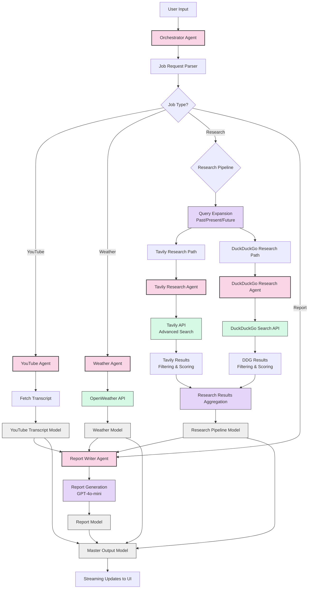

# Research Pipeline Diagram

## Research Pipeline Flow Description

1. **User Input Processing**:
   - Orchestrator Agent receives user query
   - Job Request Parser determines job type (YouTube, Weather, Research, Report)

2. **Research Pipeline** (Main Focus):
   - Query Expansion: Original query expanded into 3 sub-questions (past, present, future)
   - Parallel Research Paths:
     - **Tavily Research Path**:
       - Advanced search with relevance scoring
       - Raw content extraction for better precision
       - Results filtered by relevance score (>0.5)
     - **DuckDuckGo Research Path**:
       - Web search with snippet extraction
       - Results filtered and ranked

3. **Results Processing**:
   - Research results aggregated from both paths
   - Structured into ResearchPipelineModel
   - Passed to Report Writer Agent

4. **Report Generation**:
   - Report Writer Agent synthesizes information
   - Formats according to requested style (comprehensive, top_10, summary)
   - Creates final report using GPT-4o-mini

5. **Output Delivery**:
   - All results combined in MasterOutputModel
   - Streaming updates sent to UI
