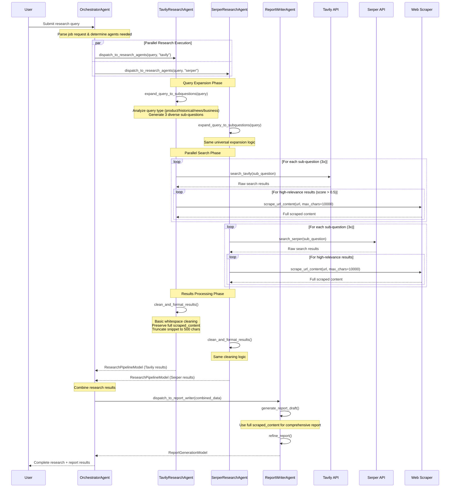
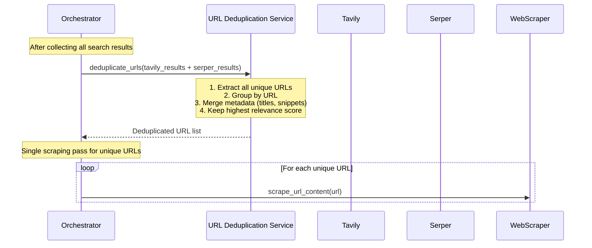

# Research and Report Pipeline Sequence Diagram

## Current Flow: User Query → Research → Report



## Current Issues & Optimization Opportunities

### 1. Deduplication Problems
- **Issue**: Same URLs may be found by both Tavily and Serper
- **Issue**: Same URLs may appear across different sub-questions
- **Impact**: Redundant scraping, duplicate content in reports, wasted API calls

### 2. Content Quality Issues
- **Issue**: Scraped content includes boilerplate (headers, footers, navigation, ads)
- **Issue**: No content relevance filtering after scraping
- **Impact**: Reports contain irrelevant information, reduced quality

## Proposed Optimizations

### A. Deduplication Strategy



**Optimal Deduplication Placement**: After search results collection, before scraping

### B. Content Cleaning Strategy

**Current scraping**: Raw HTML → BeautifulSoup text extraction → Full preservation

**Proposed enhancement**: Add intelligent content filtering during scraping

## Recommended Implementation Strategy

### 1. Deduplication Placement

**Optimal Location**: Between search results collection and web scraping

**Implementation Points**:
- In `perform_tavily_research()` and `perform_serper_research()` tools
- After all sub-question searches complete
- Before the scraping loop begins

**Benefits**:
- Eliminates redundant scraping operations
- Reduces API call costs
- Prevents duplicate content in final reports
- Maintains highest quality metadata per URL

### 2. Content Cleaning Enhancement

**Current Issue**: Scraped content includes:
- Website navigation menus
- Cookie notices and privacy banners
- Advertisement blocks
- Footer links and copyright notices
- Social media widgets
- Related articles sidebars
- Comment sections

**Proposed Revised Prompt for Content Cleaning**:

```
You are an intelligent content extractor. Your task is to clean and extract only the main article content from scraped web pages, removing all boilerplate and irrelevant elements.

CLEANING GUIDELINES:
1. EXTRACT ONLY the main article/content body
2. REMOVE navigation menus, headers, footers
3. REMOVE advertisements, promotional content
4. REMOVE cookie notices, privacy banners
5. REMOVE social media widgets, share buttons
6. REMOVE comment sections and user-generated content
7. REMOVE "related articles" or "you might also like" sections
8. REMOVE author bios unless directly relevant to the topic
9. PRESERVE article title, main content paragraphs, and relevant quotes
10. PRESERVE factual data, statistics, and key information

CONTENT STRUCTURE:
- Keep article in logical paragraph structure
- Maintain important formatting (lists, quotes, emphasis)
- Preserve factual accuracy and context
- Remove redundant or repetitive content

OUTPUT FORMAT:
- Clean, readable paragraphs
- No HTML tags or formatting artifacts
- Focus on information density and relevance
- Maximum efficiency for report generation

EXAMPLE TRANSFORMATION:

BEFORE (Raw scraped):
"Home | About | Contact | Privacy Policy | Cookie Settings
Subscribe to our newsletter! Get 20% off!
[Advertisement]
Breaking: New AI Model Achieves 95% Accuracy
By John Smith | Published 2 hours ago | Share on Twitter Facebook LinkedIn
Artificial intelligence researchers at Stanford University have developed...
[Related Articles] [Comments (47)] [Footer Links]"

AFTER (Cleaned):
"New AI Model Achieves 95% Accuracy
Artificial intelligence researchers at Stanford University have developed a new machine learning model that achieves 95% accuracy on benchmark tests..."

Apply this cleaning to the scraped content while preserving all factual information and maintaining readability.
```

### 3. Implementation Architecture

**Enhanced Scraping Function**:
```python
async def scrape_and_clean_content(url: str, max_chars: int = 10000) -> tuple[str, bool, str]:
    """
    Scrape URL and apply intelligent content cleaning.
    
    Returns:
        tuple: (cleaned_content, success, error_message)
    """
    # 1. Scrape raw content
    # 2. Apply LLM-based content cleaning
    # 3. Return cleaned, article-focused content
```

**Deduplication Service**:
```python
class URLDeduplicationService:
    def deduplicate_research_results(self, 
                                   tavily_results: List[ResearchItem], 
                                   serper_results: List[ResearchItem]) -> List[ResearchItem]:
        """
        Merge results from multiple sources, removing URL duplicates.
        
        Strategy:
        1. Group by URL
        2. Merge metadata (combine titles, snippets)
        3. Keep highest relevance score
        4. Preserve source attribution
        """
```

### 4. Expected Performance Improvements

**Deduplication Benefits**:
- 30-50% reduction in scraping operations
- Faster pipeline execution
- Reduced API costs
- Cleaner final reports

**Content Cleaning Benefits**:
- 60-80% reduction in irrelevant content
- Higher quality report generation
- Better focus on actual article content
- Improved relevance for users

### 5. Implementation Priority

1. **Phase 1**: Implement URL deduplication service
2. **Phase 2**: Add LLM-based content cleaning to scraping
3. **Phase 3**: Optimize for performance and cost efficiency

This approach maintains the current pipeline structure while significantly improving efficiency and content quality.
